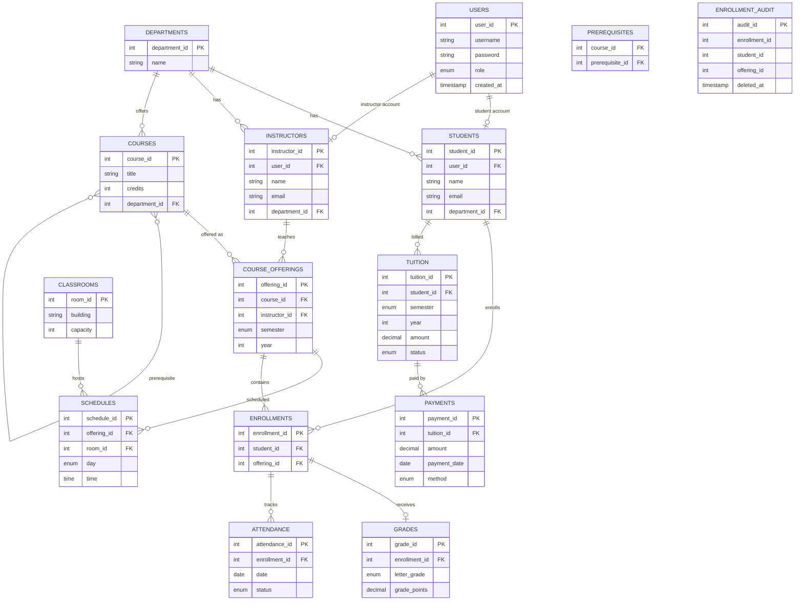

# 🎓 College Management System

**A relational database design for managing academic operations, reporting, tuition, grades, and attendance**

---

## 📌 Overview

The **College Management System** is a MySQL relational database designed to support the main operations of a college or university. It organizes students, instructors, departments, courses, enrollments, grades, attendance records, tuition records, and payments in a structured and connected way.

The database focuses on:

- Clear relationships between academic entities
- Data integrity using primary keys, foreign keys, unique constraints, and checks
- Reporting support for GPA, attendance, department totals, prerequisites, and tuition
- Stored procedures and triggers for common database operations

> The goal of this design is to make academic data easy to store, connect, protect, and analyze.

---

## 📐 Entity Relationship Diagram

---

## 🗂️ Schema Overview

<strong>📦 Click to expand - All 15 Tables</strong>

 

| Table | Description |
| --- | --- |
| `users` | Stores login accounts and role type for students, instructors, and admins. |
| `departments` | Stores academic department names. |
| `students` | Stores student profiles, emails, and department links. |
| `instructors` | Stores instructor profiles, emails, and department links. |
| `courses` | Stores course catalog information such as title, credits, and department. |
| `prerequisites` | Stores course prerequisite relationships. |
| `course_offerings` | Stores course offerings by course, instructor, semester, and year. |
| `classrooms` | Stores room building names and capacities. |
| `schedules` | Stores room, day, and time for course offerings. |
| `enrollments` | Links students to course offerings. |
| `grades` | Stores grade letters and grade points for enrollments. |
| `attendance` | Stores attendance records for enrollments. |
| `tuition` | Stores tuition charges for each student term. |
| `payments` | Stores payment transactions for tuition records. |
| `enrollment_audit` | Stores deleted enrollment records for auditing. |

---

## ⚙️ Database Features

### 🔒 Constraints

The schema uses constraints to protect data quality and prevent invalid records.

| Rule | Table | Effect |
| --- | --- | --- |
| Unique username | `users` | Prevents duplicate user accounts. |
| Unique email | `students`, `instructors` | Prevents duplicate email records. |
| Email format check | `students`, `instructors` | Adds basic validation for email values. |
| Credits between 1 and 3 | `courses` | Prevents invalid course credit values. |
| Course cannot require itself | `prerequisites` | Blocks self-prerequisite records. |
| Unique offering | `course_offerings` | Prevents duplicate course offerings in the same term. |
| Unique room slot | `schedules` | Prevents room double-booking. |
| Unique enrollment | `enrollments` | Prevents enrolling the same student twice in one offering. |
| Grade points between 0 and 4 | `grades` | Keeps GPA values valid. |
| Positive amount | `tuition`, `payments` | Prevents zero or negative financial records. |
| One tuition per term | `tuition` | Prevents duplicate billing for a student in one semester. |

---

### ⚡ Indexes

Indexes are added to improve join speed, lookup performance, and reporting queries.

| Area | Indexed Columns |
| --- | --- |
| Users | `username` |
| Students | `email`, `department_id` |
| Instructors | `email`, `department_id` |
| Courses | `department_id` |
| Prerequisites | `course_id`, `prerequisite_id` |
| Course offerings | `semester`, `year`, `course_id`, `instructor_id` |
| Schedules | `room_id`, `day`, `offering_id` |
| Enrollments | `student_id`, `offering_id` |
| Attendance | `date`, `enrollment_id` |
| Tuition | `student_id`, `status` |
| Payments | `tuition_id`, `payment_date` |

---

### 📊 Views

Views provide ready-made reporting outputs without rewriting the same joins repeatedly.

| View | Purpose |
| --- | --- |
| `student_gpa` | Calculates each student's GPA using enrolled courses and grades. |
| `vw_student_attendance` | Summarizes attendance totals and attendance percentage per student. |

---

### 🔧 Stored Procedures

Stored procedures group reusable database operations into callable routines.

| Procedure | Purpose |
| --- | --- |
| `EnrollStudent` | Enrolls a student in a course offering and prevents duplicate enrollment. |
| `GetStudentGrades` | Displays a student's course grades, semester, year, and grade points. |

---

### 🔔 Triggers

Triggers automate important database actions when data changes.

| Trigger | Event | Table | Purpose |
| --- | --- | --- | --- |
| `trg1` | `BEFORE INSERT` | `grades` | Automatically sets `grade_points` from `letter_grade`. |
| `trg2` | `AFTER DELETE` | `enrollments` | Saves deleted enrollments into `enrollment_audit`. |

---

## 📈 Reporting Queries

The system includes 8 reporting queries for analysis and decision-making. The full SQL queries are kept in the database script, while this design document summarizes what each report does.

| # | Report | Purpose |
| --- | --- | --- |
| 1 | Students with departments | Lists students with their email and department name. |
| 2 | Students per department | Counts how many students belong to each department. |
| 3 | Student GPA using CTE | Calculates student GPA using a common table expression. |
| 4 | GPA ranking | Ranks students from highest GPA to lowest GPA. |
| 5 | Top student in each department | Finds the best-performing student per department. |
| 6 | Courses with prerequisites | Shows courses that require prerequisite courses. |
| 7 | Attendance summary | Counts present, absent, and late days for each student. |
| 8 | Unpaid tuition | Shows pending tuition, total paid, and remaining balance. |

---

## 🧠 Business Rules

| Rule | Description |
| --- | --- |
| Department ownership | Students, instructors, and courses can be connected to departments. |
| Enrollment control | A student can enroll only once in the same course offering. |
| Grade consistency | Grade points are automatically matched to the selected letter grade. |
| Attendance tracking | Attendance is recorded per enrollment and date. |
| Tuition tracking | Tuition is tracked per student, semester, and year. |
| Payment tracking | Multiple payments can be connected to one tuition record. |
| Audit logging | Deleted enrollments are saved for traceability. |

---

## ✅ Design Summary

This database design provides a complete academic data model for a college management system. It combines normalized tables, relationship constraints, indexes, views, stored procedures, triggers, and reporting queries to support reliable day-to-day operations and useful academic reporting.

The result is a structured database that can support student management, course administration, grade tracking, attendance monitoring, and tuition payment analysis.

