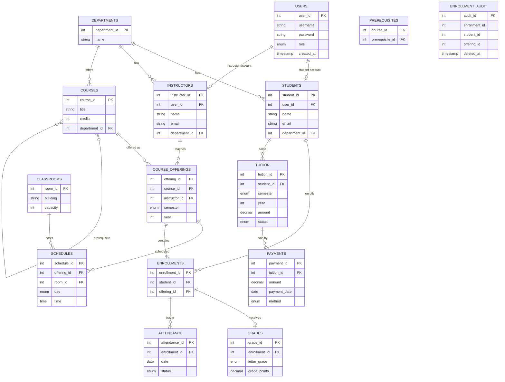

<div align="center">

# 🎓 College Management System

**A relational MySQL database for managing academic operations — students, courses, grades, attendance, and tuition**


</div>

---

## 📌 Overview

The **College Management System** is a MySQL 8.0+ relational database designed to handle the core operations of a college or university. It connects students, instructors, departments, courses, enrollments, grades, attendance, tuition, and payments in a fully normalized structure.

**Design goals:**

- Clear, enforced relationships between all academic entities
- Data integrity through primary keys, foreign keys, unique constraints, and check constraints
- Automated logic via triggers — no manual input needed for grade points or audit trails
- Reusable stored procedures for common operations
- Ready-made views and reporting queries for GPA, attendance, and financial analysis

---

## 📁 Project Files

| File | Description |
|---|---|
| `schema.sql` | Full schema: tables, indexes, views, procedures, and triggers |
| `queries.sql` | 8 reporting queries for analysis and decision-making |
| `README.md` | This document |

---

## 📐 Entity Relationship Diagram



---

## 🗂️ Tables

<details>
<summary><strong>Click to expand — all 15 tables</strong></summary>

<br>

| Table | Description |
|---|---|
| `users` | Login accounts with role type: `student`, `instructor`, or `admin` |
| `departments` | Academic department names |
| `students` | Student profiles linked to a user account and department |
| `instructors` | Instructor profiles linked to a user account and department |
| `courses` | Course catalog with title, credits (1–3), and department |
| `prerequisites` | Many-to-many table mapping courses to their required prerequisites |
| `course_offerings` | A course taught by an instructor in a specific semester and year |
| `classrooms` | Physical rooms with building name and seating capacity |
| `schedules` | Day, time, and room assignment for a course offering |
| `enrollments` | Links a student to a course offering |
| `grades` | Letter grade and computed grade points for an enrollment |
| `attendance` | Per-session attendance record (Present / Absent) |
| `tuition` | Tuition charge per student per term |
| `payments` | Individual payment transactions against a tuition record |
| `enrollment_audit` | Immutable log of deleted enrollment records |

</details>

---

## ⚙️ Schema Features

### 🔒 Constraints

| Rule | Table | Effect |
|---|---|---|
| Unique username | `users` | Prevents duplicate accounts |
| Unique email | `students`, `instructors` | Prevents duplicate email records |
| Email format check | `students`, `instructors` | Basic validation using `LIKE '%_@_%._%'` |
| Credits 1–3 | `courses` | Rejects invalid credit values |
| No self-prerequisite | `prerequisites` | Blocks a course from requiring itself |
| Unique offering | `course_offerings` | Prevents the same course/instructor/term combination from being added twice |
| Unique room slot | `schedules` | Prevents double-booking a room at the same day and time |
| Unique enrollment | `enrollments` | Prevents a student from enrolling in the same offering twice |
| Grade points 0.00–4.00 | `grades` | Keeps GPA values in valid range |
| Positive amounts | `tuition`, `payments` | Rejects zero or negative financial records |
| One tuition per term | `tuition` | Prevents duplicate billing for the same student in the same semester |
| Year range 2000–2100 | `course_offerings`, `tuition` | Blocks out-of-range year values |

---

### ⚡ Indexes

| Table | Indexed Columns | Purpose |
|---|---|---|
| `users` | `username` | Fast login lookup |
| `students` | `email`, `department_id` | Email search and department joins |
| `instructors` | `email`, `department_id` | Email search and department joins |
| `courses` | `department_id` | Department-based course filtering |
| `prerequisites` | `course_id`, `prerequisite_id` | Prerequisite graph traversal |
| `course_offerings` | `semester`, `year`, `course_id`, `instructor_id` | Term and course filtering |
| `schedules` | `room_id`, `day`, `offering_id` | Room conflict detection |
| `enrollments` | `student_id`, `offering_id` | Student and offering lookups |
| `attendance` | `date`, `enrollment_id` | Date-range and per-enrollment queries |
| `tuition` | `student_id`, `status` | Unpaid tuition filtering |
| `payments` | `tuition_id`, `payment_date` | Payment history and balance queries |

---

### 📊 Views

| View | Description |
|---|---|
| `student_gpa` | Credit-weighted GPA per student, calculated across all graded enrollments |
| `vw_student_attendance` | Per-student totals for present and absent sessions, plus attendance percentage (present sessions / total sessions) |

---

### 🔧 Stored Procedures

| Procedure | Parameters | Description |
|---|---|---|
| `EnrollStudent` | `IN p_student_id INT`, `IN p_offering_id INT`, `OUT p_message VARCHAR(100)` | Enrolls a student and returns a success or duplicate-error message |
| `GetStudentGrades` | `IN p_student_id INT` | Returns a student's full grade history with course, semester, year, letter grade, and grade points |

**Usage examples:**

```sql
-- Enroll student 1 in offering 3
CALL EnrollStudent(1, 3, @msg);
SELECT @msg;
-- → 'Success: Student enrolled successfully.'
-- → 'Error: Student is already enrolled in this offering.'

-- Get full grade report for student 1
CALL GetStudentGrades(1);
```

---

### 🔔 Triggers

| Trigger | Event | Table | Description |
|---|---|---|---|
| `trg1` | `BEFORE INSERT` | `grades` | Auto-sets `grade_points` from `letter_grade` — no manual input needed |
| `trg2` | `AFTER DELETE` | `enrollments` | Copies deleted enrollment records to `enrollment_audit` for traceability |
| `trg3` | `AFTER INSERT` | `payments` | Recalculates `tuition.status` to `Pending` / `Partial` / `Paid` after each payment |

**Grade point mapping applied by `trg1`:**

| Letter | Points | Letter | Points |
|---|---|---|---|
| A | 4.00 | C+ | 2.70 |
| A- | 3.70 | C | 2.40 |
| B+ | 3.30 | D | 2.00 |
| B | 3.00 | F | 0.00 |


---

## 📈 Reporting Queries

Eight analytical queries are included in `queries.sql`.

| # | Report | Technique |
|---|---|---|
| 1 | Students with departments | `LEFT JOIN` |
| 2 | Student count per department | `GROUP BY`, `COUNT` |
| 3 | Student GPA | CTE + `AVG` |
| 4 | GPA ranking | CTE + `RANK()` window function |
| 5 | Top student per department | CTE + `ROW_NUMBER()` with `PARTITION BY` |
| 6 | Courses with prerequisites | Self-join on `courses` |
| 7 | Attendance summary per student | Conditional `SUM(CASE ...)` |
| 8 | Unpaid tuition with balance | `LEFT JOIN` + `COALESCE` + `HAVING` |


---

## 🧠 Business Rules

| Rule | Description |
|---|---|
| Department ownership | Students, instructors, and courses each belong to one department |
| Enrollment uniqueness | A student may enroll in a given course offering only once |
| Grade consistency | `grade_points` is always derived from `letter_grade` by `trg1` — never set manually |
| Attendance granularity | One attendance record per enrollment per session date |
| Tuition uniqueness | One tuition record per student per semester/year combination |
| Payment flexibility | A single tuition record can be paid through multiple partial payments |
| Cascade deletes | Deleting a student cascades to enrollments, grades, attendance, and tuition |
| Audit trail | Every deleted enrollment is preserved in `enrollment_audit` with a timestamp |

---

## ✅ Design Summary

This database provides a complete academic data model across 15 normalized tables, with constraints and indexes enforcing integrity and performance throughout. Three triggers automate grade point calculation, audit logging, and payment reconciliation. Two stored procedures wrap the most common write operations. Two views expose pre-computed GPA and attendance summaries for reporting.

The schema is designed to be extended — role-based views, waitlist logic, soft-delete patterns, and additional reporting queries can all be layered on top without restructuring the core design.
